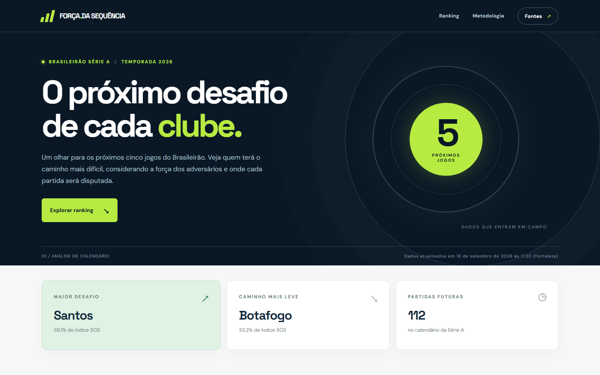
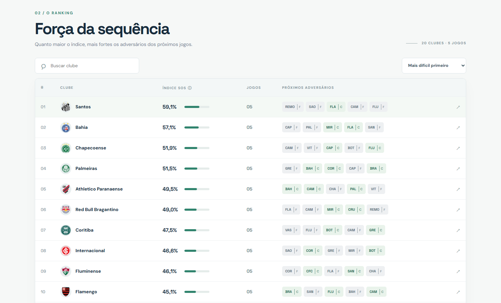
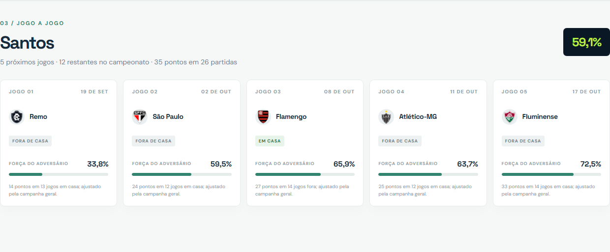

# Força da sequência — Brasileirão Série A

Site estático que classifica a dificuldade dos **próximos cinco jogos** de cada clube da Série A. A coleta usa as respostas JSON da ESPN para classificação e calendário. O site mostra o último snapshot publicado, sem depender de um servidor Python ou de consultas à ESPN no navegador do visitante.

## Prévia

Capturas de partes da página, feitas com o snapshot de 18/09/2026. Os números exibidos no site mudam com as atualizações dos dados.

**Visão geral**



**Ranking de dificuldade**



**Análise jogo a jogo**



## Executar localmente

Requer Python 3.12 ou superior.

```powershell
python -m venv .venv
.venv\Scripts\Activate.ps1
python -m pip install -r requirements.txt
python -m schedule_strength --season 2026
python -m http.server 8000
```

Abra `http://localhost:8000`. O snapshot inicial está em `data/processed/snapshot.json`. Abrir `index.html` diretamente por `file://` não carrega JSON em alguns navegadores; use o servidor local. Em Linux/macOS, ative o ambiente com `source .venv/bin/activate`.

O ranking pode ser hospedado como site estático, por exemplo com GitHub Pages apontando para a raiz da branch principal. O arquivo `index.html`, `assets/` e `data/processed/snapshot.json` precisam ser publicados juntos.

## Cálculo

Para cada jogo futuro, medimos o aproveitamento do **adversário no local da partida**. Se o clube analisado joga fora, usamos a campanha do adversário em casa; se joga em casa, a campanha do adversário fora.

```text
aproveitamento geral = pontos na classificação / (3 × jogos na classificação)
força do adversário = (pontos no local / 3 + 5 × aproveitamento geral)
                       / (jogos no local + 5)
SOS do clube = média da força dos adversários nos próximos até 5 jogos
```

Os cinco jogos equivalentes à campanha geral suavizam amostras pequenas de mandante/visitante. O SOS fica entre 0 e 1 e aparece no site em porcentagem. **Não é uma probabilidade de vitória**: é um índice de força dos adversários no contexto do mando. Quando restarem menos de cinco jogos, a média usa os disponíveis. Times sem jogos futuros ficam sem SOS.

## Dados e atualização

`python -m schedule_strength` busca a classificação e os jogos da Série A para o ano atual e grava o JSON de forma atômica. Use `--season AAAA` para uma temporada específica. A identificação dos clubes é feita por IDs da ESPN, sem correspondência por nome ou slug. O processo interrompe a publicação se faltar um clube ou se um jogo apontar para um adversário fora da classificação. Ele também não inclui jogos antigos adiados sem nova data futura.

O workflow em `.github/workflows/refresh-data.yml` atualiza o snapshot às **08:00 e 20:00 UTC** e pode ser acionado manualmente em *Actions → Atualizar dados do Brasileirão*. Para a rotina funcionar, o repositório precisa permitir escrita por GitHub Actions. O GitHub Pages, se configurado para a branch, publicará o JSON atualizado junto com a página.

A ESPN pode alterar os endpoints ou campos sem aviso; eles não são uma API pública documentada. Se a coleta falhar, o workflow falha e o último snapshot continua visível com data de atualização e aviso de dados antigos. As respostas usadas são:

- [Classificação](https://site.api.espn.com/apis/v2/sports/soccer/bra.1/standings?season=2026)
- [Calendário e resultados](https://site.api.espn.com/apis/site/v2/sports/soccer/bra.1/scoreboard?dates=2026&limit=500)

Os scripts antigos em `scrappers/` e `operations/example.py` foram mantidos como histórico do protótipo. O site novo usa apenas `schedule_strength/`, `assets/` e o snapshot JSON.

## Verificação

```powershell
python -m unittest discover -s tests -v
```

Os testes verificam o ajuste de mando, a média dos jogos futuros e a interrupção quando os dados estão incompletos.
